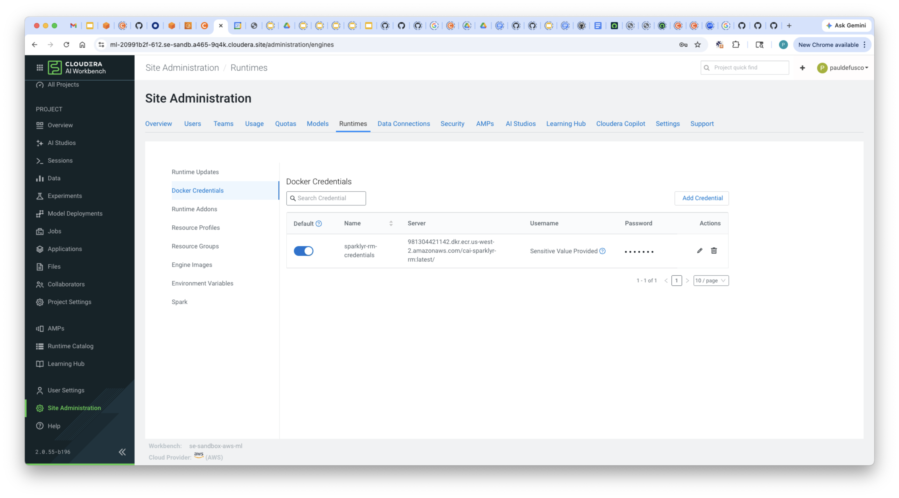
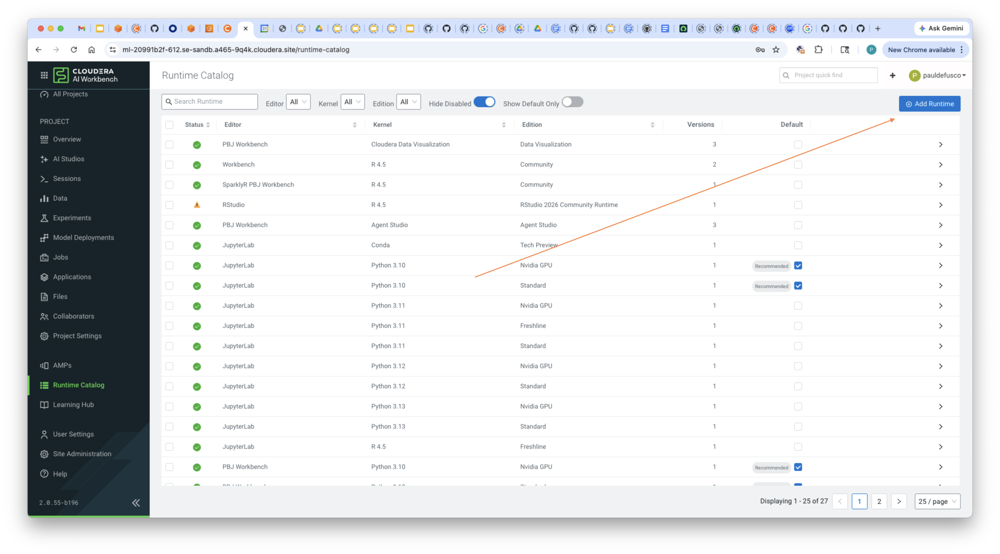
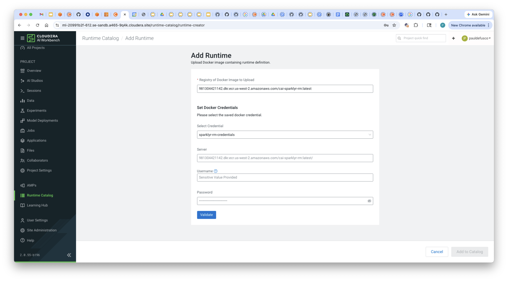
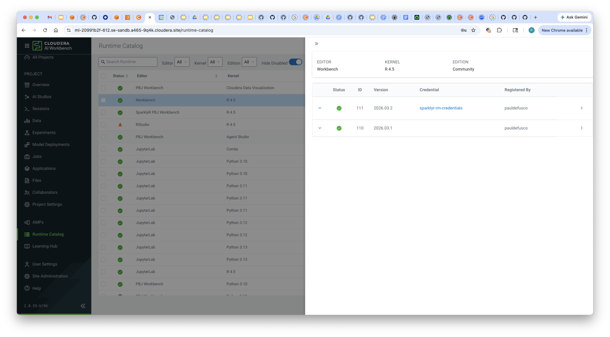
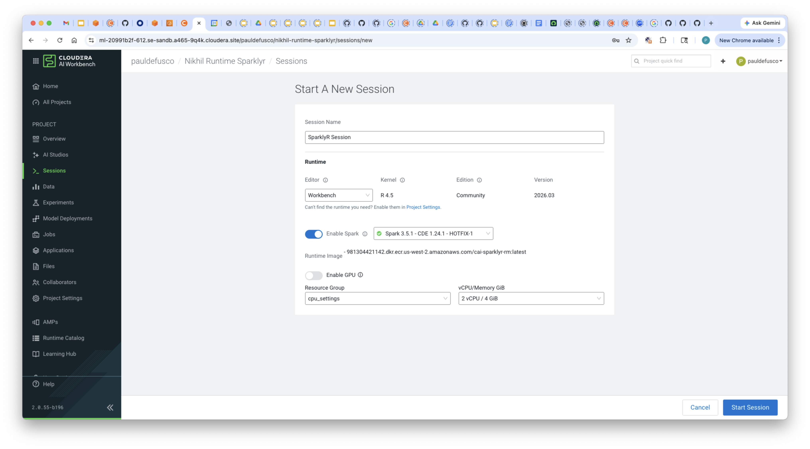
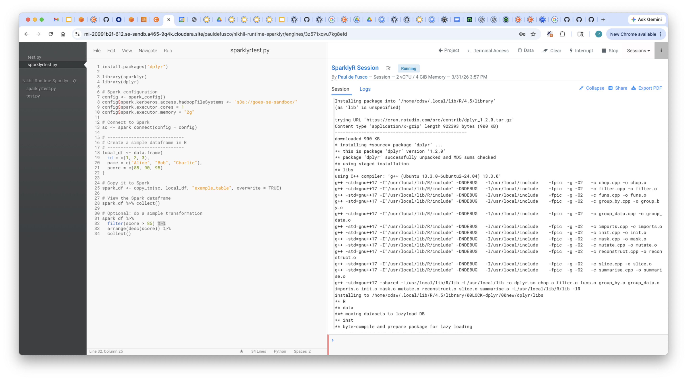
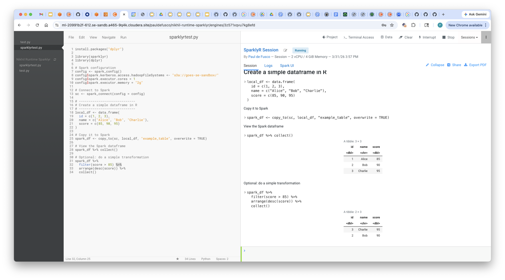

# CAI SparklyR Runtime

## Objective

This demo shows how to create a custom Sparkly R runtime extending the Cloudera AI R 4.5 PBJ Runtime, push it to a private AWS ECR repository, and then import it into the CAI Runtime Catalog.

The demo is divided in five parts:

1. Create Dockerfile
2. Build and push image to AWS ECR
3. Create Docker Credentials in CAI Workbench
4. Import Runtime in the Catalog
5. Run a Test Session

This demo can be used as general reference for CAI admins and users who want to create custom R runtimes from a private ECR repository.

## Requirements

In order to set up this demo you need the following:

* A CAI Workbench in Cloudera Public Cloud Runtime 7.3.1 or above in AWS.
* An AWS account user and credentils.
* A local Docker setup.

## End to End Demo

### 1. Create Dockerfile

In your local environment, create a new Dockerfile (if you cloned this github, an example has already been provided). Familiarize yourself with the code.

```
# Base Cloudera AI Runtime
FROM docker.repository.cloudera.com/cloudera/cdsw/ml-runtime-pbj-workbench-r4.5-standard:2026.01.1-b6

# Switch to root to install R packages if needed
USER root

# Install sparklyr without pulling Spark dependencies
# (sparklyr itself does not install Spark unless explicitly requested via spark_install())
RUN R -e "install.packages('sparklyr', repos='https://cloud.r-project.org', dependencies=TRUE)"

# Override Runtime label and environment variables metadata
ENV ML_RUNTIME_EDITOR="Workbench" \
    ML_RUNTIME_EDITION="Community" \
    ML_RUNTIME_SHORT_VERSION="2026.03" \
    ML_RUNTIME_MAINTENANCE_VERSION="2" \
    ML_RUNTIME_FULL_VERSION="2026.03.2" \
    ML_RUNTIME_DESCRIPTION="Runtime for Nikhil"

LABEL com.cloudera.ml.runtime.editor=$ML_RUNTIME_EDITOR \
      com.cloudera.ml.runtime.edition=$ML_RUNTIME_EDITION \
      com.cloudera.ml.runtime.full-version=$ML_RUNTIME_FULL_VERSION \
      com.cloudera.ml.runtime.short-version=$ML_RUNTIME_SHORT_VERSION \
      com.cloudera.ml.runtime.maintenance-version=$ML_RUNTIME_MAINTENANCE_VERSION \
      com.cloudera.ml.runtime.description=$ML_RUNTIME_DESCRIPTION
```

Notice the base CAI runtime "ml-runtime-pbj-workbench-r4.5-standard:2026.01.1-b6" is extended.

The CAI engineering team periodically tests, maintains and publishes this and other runtimes in [this GitHub repository](https://github.com/cloudera/ml-runtimes).

In this example, the "sparklyr" package is installed in the runtime so users who launch sessions, jobs, and other workloads in CAI don't have to.

You can customize this Dockerfile to include more packages. And, as shown in "sparklyrtest.R", you can still install other packages on top of the ones provided in the runtime. When you do this, package dependencies are saved in the project files so there is no need to reinstall in the future.

Notice Runtime Metadata is mandatory and must uniquely identify each build. For a more detailed explanation of the metadata fields, please visit [this page](https://docs.cloudera.com/machine-learning/cloud/runtimes/topics/ml-metadata-for-custom-runtimes.html) in the documentation.

### 2. Build and Push Image to AWS ECR

Using the AWS CLI, run the following commands from your terminal.

```
% aws ecr create-repository \
  --repository-name cai-sparklyr-rm \
  --region us-west-2
  {
      "repository": {
          "repositoryArn": "arn:aws:ecr:us-west-2:123456789:repository/cai-sparklyr-rm",
          "registryId": "123456789",
          "repositoryName": "cai-sparklyr-rm",
          "repositoryUri": "123456789.dkr.ecr.us-west-2.amazonaws.com/cai-sparklyr-rm",
          "createdAt": "2026-03-31T15:24:46.408000-07:00",
          "imageTagMutability": "MUTABLE",
          "imageScanningConfiguration": {
              "scanOnPush": false
          },
          "encryptionConfiguration": {
              "encryptionType": "AES256"
          }
      }
  }
```

```
aws ecr get-login-password --region us-west-2 | \
  docker login --username AWS --password-stdin 123456789.dkr.ecr.us-west-2.amazonaws.com/cai-sparklyr-rm
```

```
docker build -t cai-sparklyr-rm:latest .
```

```
docker tag cai-sparklyr-rm:latest \
  123456789.dkr.ecr.us-west-2.amazonaws.com/cai-sparklyr-rm:latest  
```

```
docker push \
  123456789.dkr.ecr.us-west-2.amazonaws.com/cai-sparklyr-rm
```

```
aws ecr describe-images \
  --repository-name cai-sparklyr-rm \
  --region us-west-2
```

### 3. Create Docker Credentials in Cloudera AI Workbench

Navigate to "Site Administration" -> "Runtimes" -> "Docker Credentials" and create a new credential and set the following fields:

```
Name: sparklyr-rm-credentials
Server: the full image URI as shown when the repository is created e.g. "123456789.dkr.ecr.us-west-2.amazonaws.com/cai-sparklyr-rm:latest/" - this value is also available in the ECR UI.
Username: AWS
Password: your AWS token. This can be obtained with: "aws ecr get-login-password --region us-west-2"
```



### 4. Import Runtime in the Catalog and Run Test Session

In the Runtime Catalog, select the "Add Runtime" icon.



Apply the previously configured credentials and input the entire URI path in the "Registry of Docker Image to Upload" field.



The image will now become available in the Runtime Catalog UI



### 5. Run Test Session

Clone this GitHub repository as a new CAI project and add the new runtime.


Create a test session and run the code. Notice the URI is now showing as the Runtime ID in the Session UI.

```
Name: Sparklyr Test Session
Editor: Workbench
Kernel: R 4.5
Edition: Community
Version: 2026.03
Enable Spark: version 3.5
Enable GPU: none
Resource Profile: 2 vCPU / 4 GiB Memory
```



Next, run "sparklyrtest.R" and validate output.





## Summary and Next Steps

**Cloudera AI Runtimes** provide a structured way to package and manage reproducible environments for data science and machine learning workloads, enabling teams to define lightweight, customizable containers with specific editors, languages, and dependency stacks.

Runtimes are registered and managed in the Runtime Catalog, which lists all available standard and custom environments for interactive sessions or production workloads, and can be imported from AWS ECR and other image registries.

Administrators and data scientists can create and import new runtimes in the catalog by adding custom images and credentials, enabling secure access to registries like AWS ECR and on‑prem registries, and ensuring that the right tools and packages are available where and when teams need them. ([Cloudera Documentation][1])

### Cloudera AI Runtime Documentation & Blogs

* **Runtime Catalog documentation** – Official guide to viewing and managing the Runtime Catalog in Cloudera AI. ([Cloudera Documentation][1])
  *[https://docs.cloudera.com/machine-learning/1.5.5/runtimes/topics/ml-using-runtime-catalog.html](https://docs.cloudera.com/machine-learning/1.5.5/runtimes/topics/ml-using-runtime-catalog.html)*

* **Adding new ML Runtimes** – How to register custom ML Runtimes and add Docker registry credentials. ([Cloudera Documentation][2])
  *[https://docs.cloudera.com/machine-learning/cloud/managing-runtimes/topics/ml-adding-new-ml-runtimes.html](https://docs.cloudera.com/machine-learning/cloud/managing-runtimes/topics/ml-adding-new-ml-runtimes.html)*

* **Adding Docker registry credentials in CAI** – Instructions for adding Docker registry credentials (e.g., ECR) for pulling images. ([Cloudera Documentation][3])
  *[https://docs.cloudera.com/machine-learning/1.5.5/managing-runtimes/topics/ml-add-docker-registry-credentials-runtimes.html](https://docs.cloudera.com/machine-learning/1.5.5/managing-runtimes/topics/ml-add-docker-registry-credentials-runtimes.html)*

* **ML Runtimes overview and customization** – Full docs on ML Runtimes, editors, kernels, add‑ons, and custom images. ([Cloudera Documentation][4])
  *[https://docs.cloudera.com/machine-learning/cloud/runtimes/index.html](https://docs.cloudera.com/machine-learning/cloud/runtimes/index.html)*

* **Cloudera Blog: Building Custom Runtimes with Editors** – Example of customizing and using different editors in ML Runtimes. ([blog.cloudera.com][5])
  *[https://blog.cloudera.com/building-custom-runtimes-with-editors-in-cloudera-machine-learning/](https://blog.cloudera.com/building-custom-runtimes-with-editors-in-cloudera-machine-learning/)*
